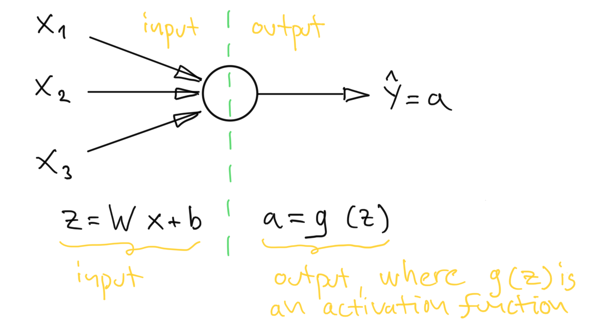
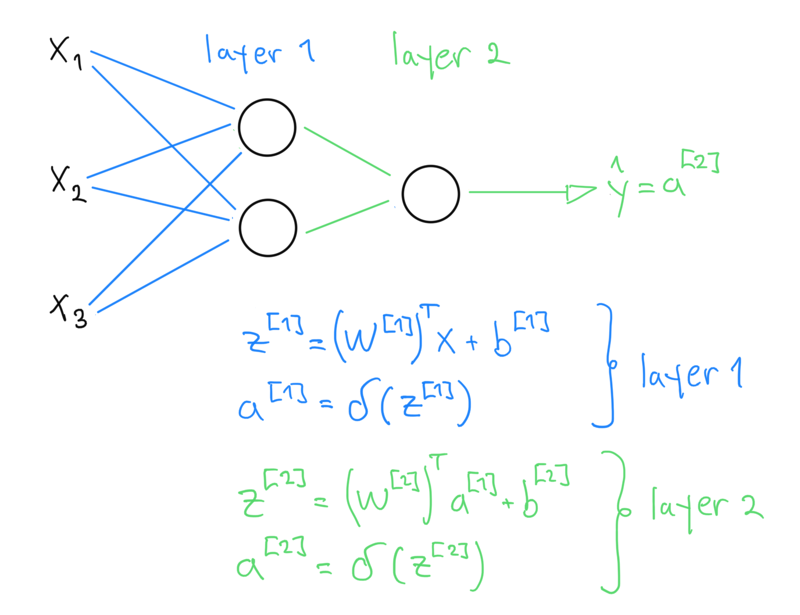

# Feed-Forward Neuron Model

A simple feedforward neuron consists of inputs, weights, activation function and an output

* $x$ input vector
* $W$ weight matrix
* $b$ bias term
* $g(\cdot)$ activation function
* $a$ output from the neuron

Here we have separated the bias term, but to all intents and purposes it is one of the learnable weights. The model works are follows: the input side combines the inputs, $x$,
based on the weight matrix $w$ and the bias term $b$ using a simple linear operation:

$$z=Wx + b$$

Result of the linear operation, $z$, goes through an activation function:

$$a = g(z)$$

Typically non-linear activation functions are used so that the neuron can better model non-linear functions. Following figure shows a single neuron with 3-inputs and 1-output.

<figure align="center">
    
    <figcaption>Figure 1. Description of a neuron.</figcaption>
</figure>

As we can see from Figure 1, the neuron model has input- and output sides. The input side is a simple linear operation $z=Wx + b$ and the output from the model is
$g(z)$. A neural network is obtained by combining several neurons per layers, and outputting results from one layer to another as shown in the Figure 2.

<figure align="center">
    
    <figcaption>Figure 2. Here we have a simple neural network with an input- and output layers.</figcaption>
</figure>

In Figure 2, $W^{[1]}$ refers to the weights in the first layer. Each layer might have a different activation function, depending on what sort of a problem we are trying
to solve with the neural network.
