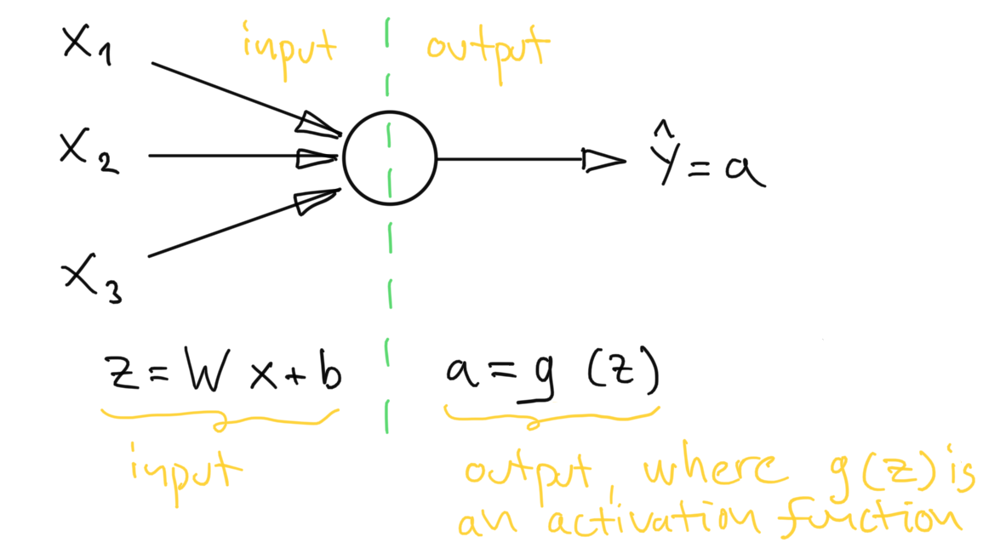
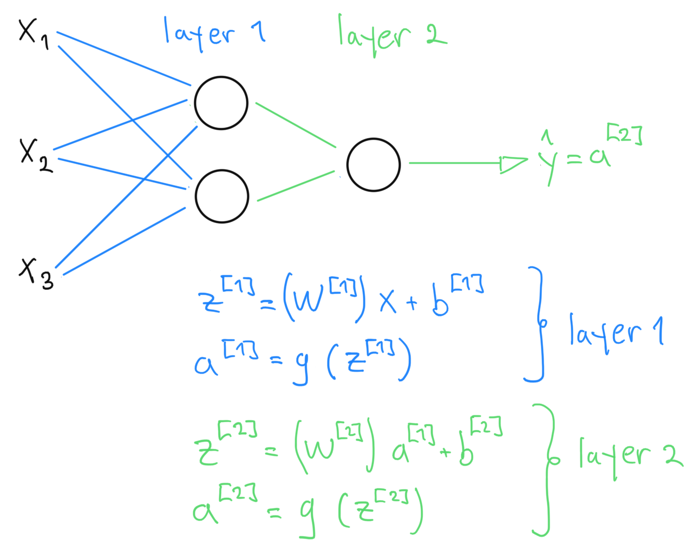

# Neuron Model

The neuron can be thought of having two functions, the first (input side) is a linear operation that combines the input, and the second (output side) applies a non-linear activation function to the input.

A neural network is obtained by combining several neurons per layers, and outputting results from one layer to another.

