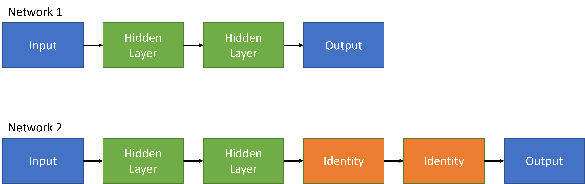
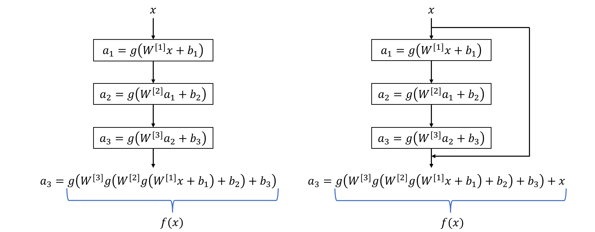
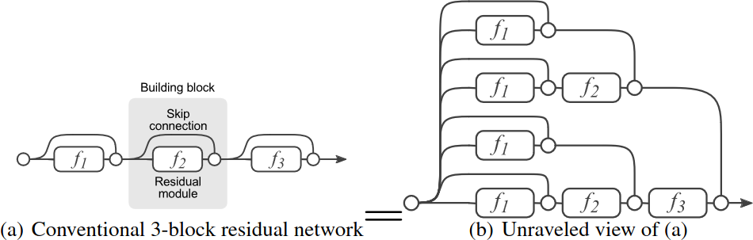
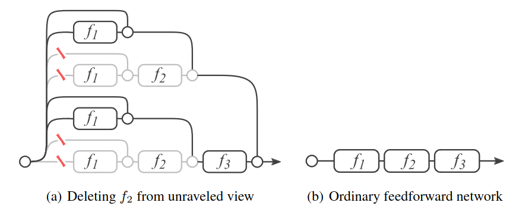

# Residual Neural Network aka ResNet

## Basics

A residual neural network is a feed-forward artificial neural network (ANN) that uses skip connections (or shortcuts) that are used to jump over some layers.
The two main reasons to add skip connections are:

* to avoid the problem of [vanishing gradients](./VanishingAndExplodingGradients.md), and
* to mitigate the degradation (**accuracy saturation**) problem when adding more layers to a suitably deep model

In theory, when adding more layers to the network, the performance should be as good, or better, than that of a model with less layers. However, after the model a has
certain number of layers, adding more layers starts to decrease performance (accuracy) of the model. This seems counter intuitive, as in order to maintain
accuracy of the smaller model, the newly added layers to the larger model would only need to learn the identity function, i.e. $a = g(x) \rightarrow a = x$.
Figure 1 demonstrates what this means in practice.

<figure align="center">
    
    <figcaption>Figure 1. In theory for network 2 to achieve accuracy of network 1, the added layers would only need to learn the identity function.</figcaption>
</figure>

In practice, however, this is not quite so straightforward due to several reasons. For one, due to the number of weights in larger networks that the model
has to learn, it might take an infeasible amount of training cycles before the weights corresponding to an identity function would be learned. Another reason 
is that either due to numerical instabilities, or due to the system getting stuck at a local minima, the model might never converge to a global minimum where 
the weights of the new layers would yield better results.

### Skip Connections

Figure 2. shows the basic idea behind the skip connections. 

<figure align="center">
    
    <figcaption>Figure 2. Left image: a network without skip connections, right image: a network with a skip connection.</figcaption>
</figure>

As it was established previously, in very deep networks learning the identity function might be infeasible. In the case with the skip connection, with 
$x^{[i]} = f(x^{[i-1]}) + x^{[i-1]}$, if the all weights are initialized close to zero, then effectively we have $x^{[i]} \approx x^{[i-1]}$. The reason why these sorts of 
networks are called residual networks is due to the fact that the system only needs to learn the weights of the residual $f(x^{[i-1]}) = x^{[i]} - x^{[i-1]}$.

## Modern View

In a paper called [Residual Networks Behave Like Ensembles of Relatively Shallow Networks](https://arxiv.org/abs/1605.06431) the authors present a novel
way of understanding how ResNet:s behave. Even if the paper dates back to 2016, the findings are today as relevant as they were at the time of publication.
Due to the skip connections, data can flow from any residual layer to any subsequent residual layer via different paths. With residual layer we refer
to residual blocks, i.e. a residual block is seen as a *layer* in this context. The skip connections make residual networks very different
from traditional strictly sequential networks, and the authors propose that residual networks can be seen as a collection of many paths of differing lengths.
Therefore, a residual network can be thought of being a collection of relatively shallow networks. Interestingly, by removing single layers
from residual networks at test time does not noticeably affect their performance. As the authors point out, this is surprising since removing a single layer
in the case of traditional architectures, such as VGG, leads to a dramatic loss of performance. Figure 3. shows a 3-block residual network, and an unraveled view of it.

<figure align="center">
    
    <figcaption>Figure 3. (a) shows a traditional representation of a 3-block residual network, while (b) shows an unraveled view of the same.</figcaption>
</figure>

Residual networks are conventionally shown as one residual block after another, as shown in Figure 3 (a). By unrolling the recursion into 
an exponential number of nested terms, the network can be *unraveled*, thus revealing shared structure of the network. In a residual network the data flows through
several paths from input to output, as is shown in Figure 3. (b). Figure 4. shows the effect of deleting a layer in a residual network.

<figure align="center">
    
    <figcaption>Figure 4. (a) Deleting a layer in residual networks at test time is equivalent to zeroing half of the paths. (b) In ordinary
    feed-forward networks, such as VGG, deleting individual layers alters the only viable path from input to output.</figcaption>
</figure>

As we can see from Figure 4. (a), deleting a layer in a residual network at test time is equivalent to zeroing half of the paths. In the case of a traditional
feed-forward network architecture, such as VGG or AlexNet, the data flows from input to output through a single valid path, as can be seen in Figure 4. (b).

### Conclusions

* Paths in residual networks do not strongly depend on each other and they behave like an ensemble.
* Deleting individual layers from traditional network architectures, like VGG, has a considerable negative impact on the performance.
Removing a single layer means that the only viable path is corrupted.
* Deleting individual layers from residual networks, leaving the skip connection, has minimal impact on the performance. Paths
in residual networks do not strongly depend on each other, even if they are trained jointly.
* Generally, data flows along all paths in residual networks. However, not all paths carry the same amount of gradient. The length of the
paths through the network affects the gradient magnitude during backpropagation. The authors show that the paths through the networks
that contribute to the gradient during training are *shorter than expected*.
