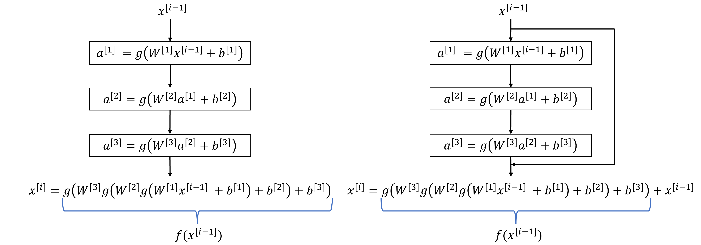

# Residual Neural Network aka ResNet

A residual neural network is a feed-forward artificial neural network (ANN) that uses skip connections (or shortcuts) that are used to jump over some layers.
The two main reasons to add skip connections are:

* to avoid the problem of [vanishing gradients](./VanishingAndExplodingGradients.md), and
* to mitigate the degradation (**accuracy saturation**) problem when adding more layers to a suitably deep model

In theory, when adding more layers to the network, the performance should be as good, or better, than that of a model with less layers. However, after the model a has
certain number of layers, adding more layers starts to decrease performance (accuracy) of the model. This seems counter intuitive, as in order to maintain
accuracy of the smaller model, the newly added layers to the larger model would only need to learn the identity function, i.e. $a = g(x) \rightarrow a = x$.
Figure 1 demonstrates what this means in practice.

<figure align="center">
    
    <figcaption>Figure 1. In theory for network 2 to achieve accuracy of network 1, the added layers would only need to learn the identity function.</figcaption>
</figure>

In practice, however, this is not quite so straightforward due to several reasons. For one, due to the number of weights in larger networks that the model
has to learn, it might take an infeasible amount of training cycles before the weights corresponding to an identity function would be learned. Another reason 
is that either due to numerical instabilities, or due to the system getting stuck at a local minima, the model might never converge to a global minimum where 
the weights of the new layers would yield better results.

## Skip Connections

Figure 2 shows the basic idea behind the skip connections. 

<figure align="center">
    
    <figcaption>Figure 2. Left image: a network without skip connections, right image: a network with a skip connection.</figcaption>
</figure>

As it was established previously, in very deep networks learning the identity function might be infeasible. In the case with the skip connection, with 
$a = f(x) + x$, if the weights are initialized close to zero, then effectively we have $a = x$. The reason why these sorts of networks are called residual
networks is due to the fact that the system only needs to learn the weights of the residual $f(x) = a - x$.
