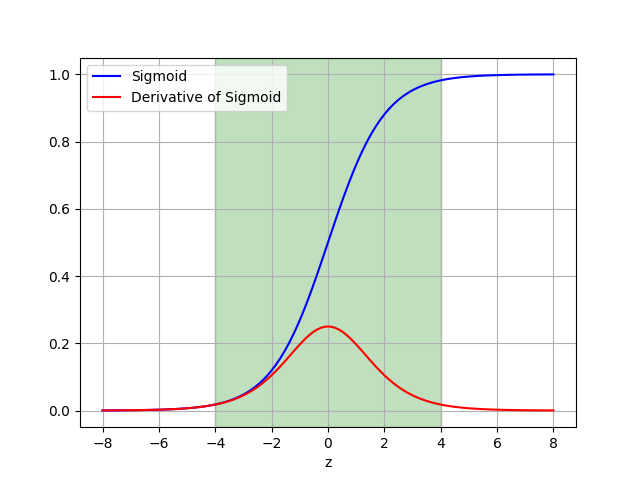

# Vanishing and Exploding Gradients

One of the problems when training very deep neural networks is that, depending on factors like the used activation functions, the
gradients might become very small. When this happens, the gradients propagated backwards (during back propagation) are so small that
the weights of the initial layers change hardly at all and the model doesn't learn what input features are important for solving the
problem at hand. This phenomenon is know as vanishing gradients.

An opposite problem is where the gradients get very large. You guessed it right, this problem is known as the exploding gradients problem.

## Influence of the Number of Layers

Suppose that we have a simple network, with 5 layers, where the activation function $g(\cdot)$ is the identity function, all the layers
have the same weights and the bias term is zero. Effectively what we have is the following:

$$a = g(W \cdot g(W \cdot g(W \cdot g(W \cdot g(W \cdot x))))) = W \cdot W \cdot W \cdot W \cdot W \cdot x = W^5 \cdot x$$

Here $\cdot$ denotes normal matrix multiplication. Now, let's suppose that the weight matrix is a 2x2 matrix, with elements only on the diagonal.
Let's see what happens if the values are above one:

$$
\begin{bmatrix}
2.0 & 0.0 \\
0.0 & 2.0
\end{bmatrix}^5 = 
\begin{bmatrix}
2.0^5 & 0.0 \\
0.0 & 2.0^5
\end{bmatrix} =
\begin{bmatrix}
32.0 & 0.0 \\
0.0 & 32.0
\end{bmatrix} 
$$

And if the values are close to zero:

$$
\begin{bmatrix}
0.1 & 0.0 \\
0.0 & 0.1
\end{bmatrix}^5 = 
\begin{bmatrix}
0.1^5 & 0.0 \\
0.0 & 0.1^5
\end{bmatrix} =
\begin{bmatrix}
0.00001 & 0.0 \\
0.0 & 0.00001
\end{bmatrix} 
$$

As we can see, even only with 5 layers if the initial values are close to zero, the output from the network is very small

## Vanishing Gradients and Activation Functions

As it was mentioned previously, the activation function being used is linked with vanishing gradients. Following is a plot of the Sigmoid
function and its derivative.

<figure align="center">
    
    <figcaption>Figure 1. Plot of the Sigmoid function and its derivative.</figcaption>
</figure>

As it can be observed from Figure 1, when the input to the Sigmoid function is less than -6, or larger than +6, the derivative becomes very small.
The further away we get from zero, the smaller the derivative becomes. Now imagine of network with several layers where the activation function is
a Sigmoid function, and it becomes clear that this can cause issues. If the input to the Sigmoid function is within the area marked with green, we then
have reasonable derivates.

## How to Deal with Vanishing Gradients

There are several ways how to deal with the problem of vanishing gradients, here are a few:

* If possible, try to use other activation functions like ReLu or Leaky ReLu, where applicable
* Batch normalization normalizes the first and second statistical moments (mean and variance) of the input into the activation function.
This means that $z \approx 0$
* Initialization of the weights is important, so that we are within the domain where the gradient of the activation function is still
reasonably large
* [Residual networks](./ResNet.md) (ResNet) is another approach that might help since in the skip connections the signal doesn't go 
through the activation function, i.e. we have $a = g(z) + x$, where $g(\cdot)$ denotes the activation function.
